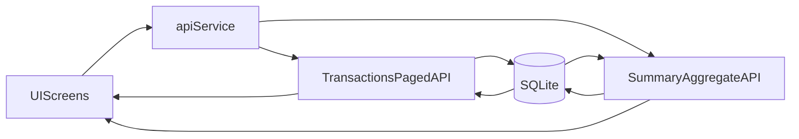

# Scale Large Sales Data Performance

## Goals
- Keep list/report screens responsive with 100k+ transactions.
- Eliminate full-history fetches and client-side heavy aggregation loops.
- Preserve existing behavior during migration (safe fallback paths).

## Current Bottlenecks
- Transaction API returns full datasets (`SELECT *`) without pagination in [D:/INVENTRADesktopApp/server/index.js](D:/INVENTRADesktopApp/server/index.js).
- Frontend screens load all transactions via `transactionService.getAll()` then filter/sort in memory:
  - [D:/INVENTRADesktopApp/src/components/Sales/SalesScreen.jsx](D:/INVENTRADesktopApp/src/components/Sales/SalesScreen.jsx)
  - [D:/INVENTRADesktopApp/src/components/Dashboard/DashboardScreen.jsx](D:/INVENTRADesktopApp/src/components/Dashboard/DashboardScreen.jsx)
  - [D:/INVENTRADesktopApp/src/components/Reports/ReportsScreen.jsx](D:/INVENTRADesktopApp/src/components/Reports/ReportsScreen.jsx)
  - [D:/INVENTRADesktopApp/src/components/StatisticalReports/StatisticalReportsScreen.jsx](D:/INVENTRADesktopApp/src/components/StatisticalReports/StatisticalReportsScreen.jsx)
- API service ignores query params on web path for `getAll` in [D:/INVENTRADesktopApp/src/services/api.js](D:/INVENTRADesktopApp/src/services/api.js).

## Implementation Strategy

### 1) Database and Query Foundation
- Add/verify performance indexes in [D:/INVENTRADesktopApp/database/sqlite-schema.js](D:/INVENTRADesktopApp/database/sqlite-schema.js):
  - `transactions(archived_at, timestamp DESC)`
  - `transactions(reference_number)` (unique/partial where non-null)
- Keep index creation idempotent with `CREATE INDEX IF NOT EXISTS`.

### 2) Add Scalable Transaction API Contracts (Backwards-Compatible)
- Extend `GET /api/transactions` and archived variant in [D:/INVENTRADesktopApp/server/index.js](D:/INVENTRADesktopApp/server/index.js) to support:
  - `page`, `limit`, `startDate`, `endDate`, `archivedOnly`, `search`, `cashier`, `paymentMethod`
- Return paginated envelope for new callers:
  - `{ items, total, page, limit, hasNextPage }`
- Keep old compatibility mode (array response) behind default/no-pagination behavior until all screens migrate.
- Avoid `SELECT *` for list endpoints; exclude heavy `items` JSON when not needed (or provide `item_count`).

### 3) Add Server-Side Summary/Aggregate Endpoints
- Add focused summary endpoints in [D:/INVENTRADesktopApp/server/index.js](D:/INVENTRADesktopApp/server/index.js), e.g.:
  - dashboard metrics (today/week/month totals, growth, recent)
  - report/statistics series (daily totals, top products/categories, payment method mix)
- Compute via SQL (`GROUP BY`, `SUM`, `COUNT`) with date filters and archived exclusion.
- Keep `GET /api/transactions/:id` detail endpoint for full line-item views.

### 4) API Client Layer Upgrade
- Update [D:/INVENTRADesktopApp/src/services/api.js](D:/INVENTRADesktopApp/src/services/api.js):
  - `transactionService.getAll(params)` should pass params for both web and native paths.
  - Add `transactionService.getPage(...)`, `getSummary(...)`, and report-specific aggregate methods.
- Preserve existing method signatures where possible to reduce blast radius.

### 5) Migrate Frontend Screens Incrementally
- Sales first (highest user impact): [D:/INVENTRADesktopApp/src/components/Sales/SalesScreen.jsx](D:/INVENTRADesktopApp/src/components/Sales/SalesScreen.jsx)
  - Replace full fetch with server pagination and server filtering.
  - Keep current UI pagination controls but source from API page data.
- Dashboard: [D:/INVENTRADesktopApp/src/components/Dashboard/DashboardScreen.jsx](D:/INVENTRADesktopApp/src/components/Dashboard/DashboardScreen.jsx)
  - Switch to summary endpoints for cards/charts/recent list.
- Reports: [D:/INVENTRADesktopApp/src/components/Reports/ReportsScreen.jsx](D:/INVENTRADesktopApp/src/components/Reports/ReportsScreen.jsx)
  - Replace local aggregations with server-generated report payloads.
- Statistical reports: [D:/INVENTRADesktopApp/src/components/StatisticalReports/StatisticalReportsScreen.jsx](D:/INVENTRADesktopApp/src/components/StatisticalReports/StatisticalReportsScreen.jsx)
  - Use aggregate APIs per selected period to avoid repeated full-array scans.
- Archives: [D:/INVENTRADesktopApp/src/components/Sales/ArchivesScreen.jsx](D:/INVENTRADesktopApp/src/components/Sales/ArchivesScreen.jsx)
  - Move to paginated archived API.

### 6) Native Bridge Compatibility Safeguards
- Keep the existing `resource/action/payload` contract in [D:/INVENTRADesktopApp/src/services/api.js](D:/INVENTRADesktopApp/src/services/api.js).
- For any new action/payload fields, provide web fallback and do not remove legacy actions.
- Add defensive parsing for both envelope and array responses during migration.

### 7) Validation and Performance Guardrails
- Add smoke checks for:
  - pagination correctness and stable ordering
  - totals consistency vs legacy behavior
  - archive filtering correctness
- Add practical limits:
  - default `limit` (e.g., 50)
  - max `limit` cap (e.g., 500)
- Benchmark target dataset locally (100k+ rows) and compare pre/post load times for Sales, Dashboard, Reports.

## Rollout Order (Low Risk)
1. Indexes + backend paginated endpoints
2. API client param/envelope support
3. Sales screen migration
4. Dashboard migration
5. Reports and StatisticalReports migration
6. Archive screen migration
7. Remove legacy full-fetch paths once all screens are switched

## Architecture Flow

## Acceptance Criteria
- Sales list opens quickly and remains smooth with 100k+ transactions.
- Dashboard and report screens no longer fetch full transaction history.
- No functional regressions in receipt view/delete/archive/restore flows.
- API remains compatible during migration period.